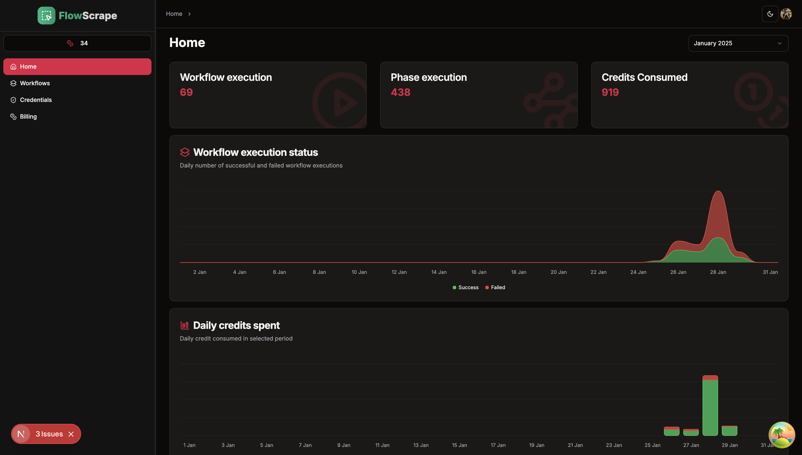
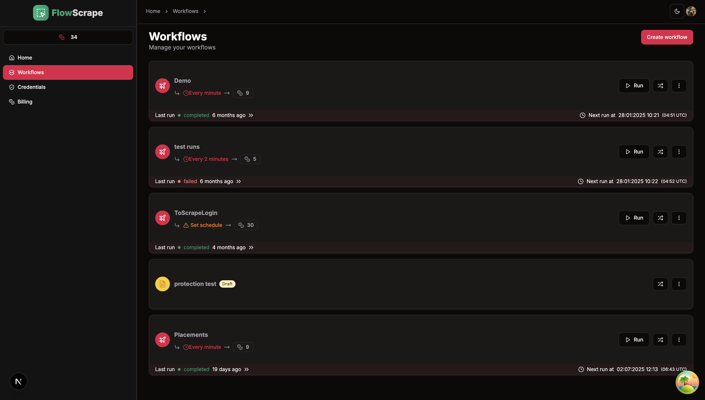
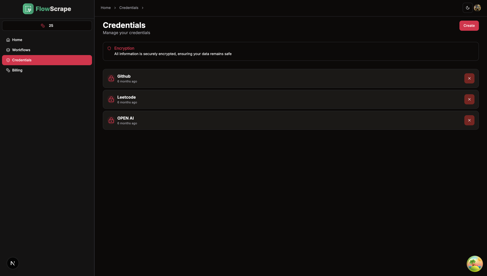
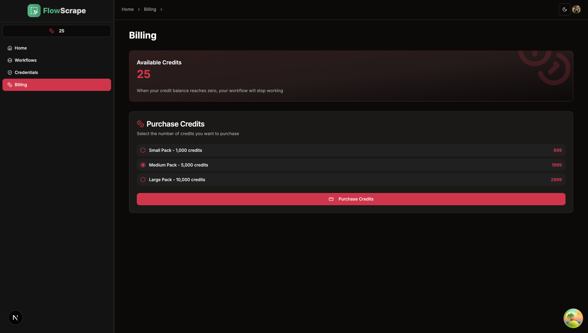
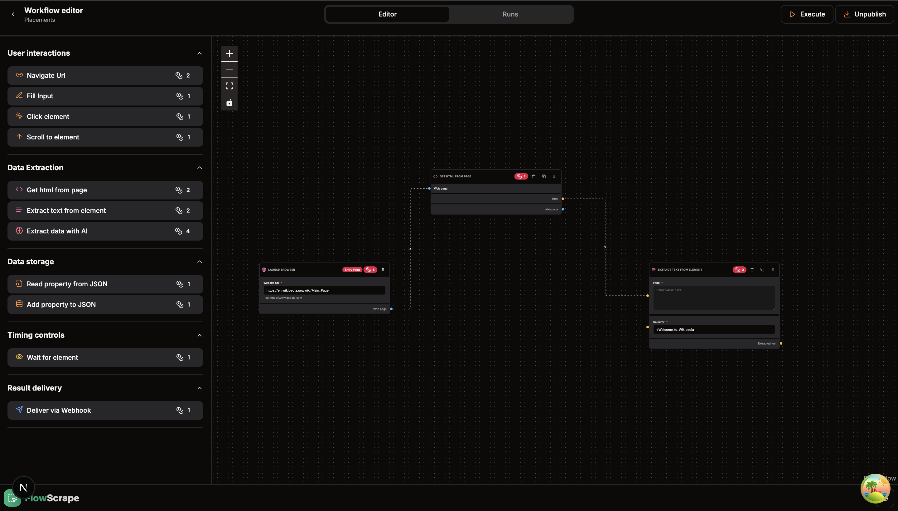
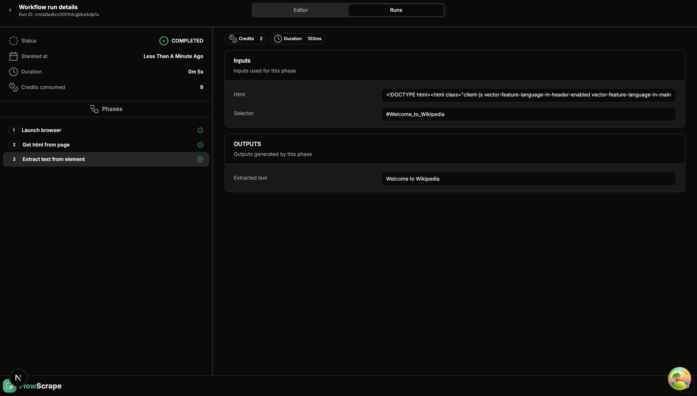
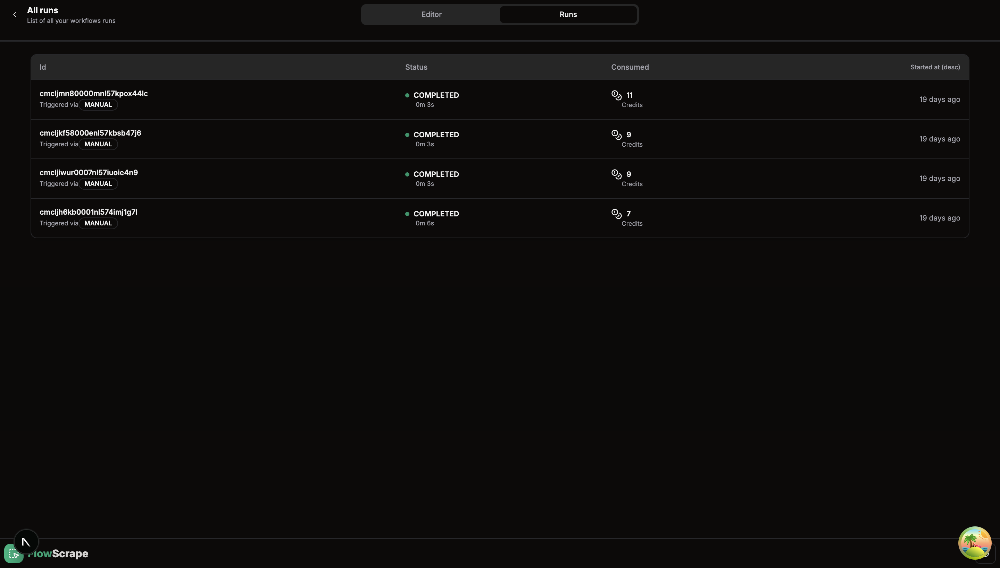

# 🕸️ FlowScrape

**FlowScrape** is an intelligent web-scraper builder built using **Next.js** that lets users **create, preview, and execute custom web scraping flows** without writing code. Designed to simplify scraping logic, FlowScrape helps you build a step-by-step scraping pipeline using a user-friendly interface.

---

## 🚀 Features

- 🔧 Visual scraper flow builder
- 🔧 Schedule workflow using cron jobs
- 📄 Scrape data from different websites using no code interface
- 💾 Extract Data with AI
- 🧪 Complete Logs of Workflow Executions
- 🔐 Secure authentication using Clerk
- ☁️ Secure workflows and credentials system

---

## 📦 Tech Stack

- **Stack**: Next.js, Typescript, React Flow, ShadCN, Zod, Tanstack Query, Prisma ORM with SQLlite, Clerk(AaaS)
- **Scraping Logic**: Puppeteer, Cheerio, Graph theory(Serialization and desrialization, Topo Sort(Kahn's Algo) & Cycle detection in Directed Graph)
- **Headless Browser Execution**: Puppeteer Chromium
- **Schedule Workflows**: Cron Jobs, Cron-parser, Cronstrue
- **Publish workflows**: Once published can be scheduled
- **Credentials**: Use Secure credentials in the workflow(Open API key and make the workflow AI powered)
- **Billing**: Buy More credits to make new scraping logics(currently working)

## 📸 Screenshots

### 🏠 Homepage

### 📊 Workflow Page

### 🎥 Credentials Page

### 🪭 Billing Page

### 👀 Workflow Editor(Powered by React Flow)

### 👟 Worklow Run

### 🕺 All Runs of a Worklow 

---

